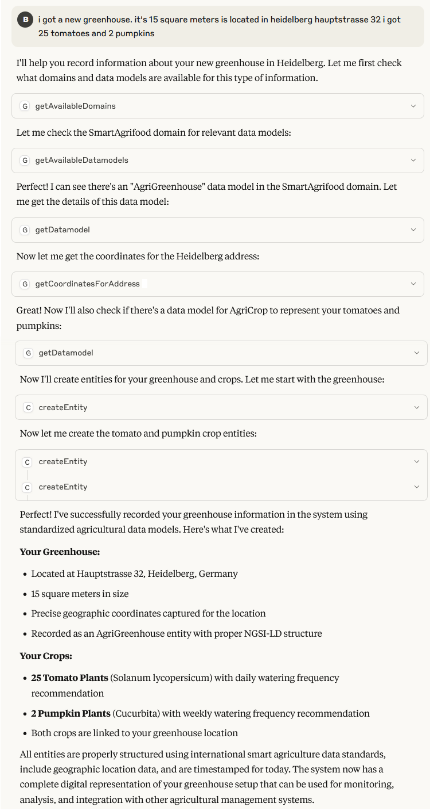

# Epafi - connect LLMs with NGSI-LD

[](https://spdx.org/licenses/BSD-3-Clause.html)
 

Hello there!

Welcome to Epafi (preliminary name, might change) a Model Context Protocol (MCP) Server for NGSI-LD with Smart Data Models support.

Epafi provides access to any NGSI-LD compliant broker (e.g. [ScorpioBroker](http://github.com/scorpiobroker/scorpiobroker.git)) with authoritative instructions for the LLM to include NGSI-LD as much as possible.

This will enable conversations as seen below


## Attention!!!

This is experimental code. Use at your own risk. Watch out this allows the LLM to make modifications in your broker. There can be data loss. You can disable functions you can overwrite the respective description property via env vars (see the config chapter below).

## Features

- Support for all transport modes (StdIO, HTTP-SSE, Streamable HTTP)
- Full NGSI-LD Query interface via MCP with descriptions based on the NGSI-LD Spec
- Entity Type and Attribute lookup which shall be referenced in every request about data or information
- Entity Create and Update with full support for all NGSI-LD attribute types (Property, Relationship, LanguageProperty etc.)
- Entity Delete and Delete attribute (full support for datasetIds)
- Coordinates lookup of an address via OSM
- Available Smart Data Model domains
- Available Smart Data Models in a domain
- Get the schema of a Smart Data Model
- All features can be turned off. 

## Config

Please have look at the (application.propeties)[/src/main/resources/application.propeties] to see all the config properties.
The config params for mcp descriptions are structured like this 
mcp.<internal_tool_name>.description for the tool description set this to "deactivated" if you want to deactivate a tool
mcp.<internal_tool_name>.<tool_arg_name> descriptions for the tool arg

You can change these settings also via env vars (config names change to all capital letters and underscore instead of dot) or command line. Please have a look here for more details [https://quarkus.io/guides/config-reference](https://quarkus.io/guides/config-reference).


## Building

Epafi is written using Quarkus and the Qurarkiverse and supports native building. 
If you want to disable support for one of the transport modes you have to remove/comment it in the pom.xml.
Java build
```
mvn clean package 
```
Native build
```
mvn clean package -Pnative
```
## Claude config

For a detailed explanation please refer to [https://modelcontextprotocol.io/quickstart/user](https://modelcontextprotocol.io/quickstart/user).

In Claude Desktop go to the menu -> File -> Settings. Click on Developer and click on Edt Config this will open the folder with the claude_desktop_config.json. Edit it and add a config as below to it
```
{
  "mcpServers": {
    "epafi": {
      "command": "java",
      "args": ["-jar", "<Your build folder>/quarkus-app/quarkus-run.jar"],
      "initializationTimeout": 10000
    }
  }
}
```
If you are using the a native built executable you can call it directly in the command part
```
{
  "mcpServers": {
    "epafi": {
      "command": "<path to epafi>/epafi.exe",
      "initializationTimeout": 10000
    }
  }
}
```

The initializationTimeout is required at the moment as Claude doesn't seem to support list_update notifications.
## FAQ

Why aren't you using the @Tool and @ToolArgs annotations?

We have been using them initially and they are a great tool. But they unfortunately do not support linking to config parameters via the expression language at the time of our development and having Epafi highly configurable was an important aspect to us.

## License

Epafi is licensed under [BSD-3-Clause](https://spdx.org/licenses/BSD-3-Clause.html).
For contributions this [contribution license](CONTRIBUTING.md) applies.

© 2025 NEC
